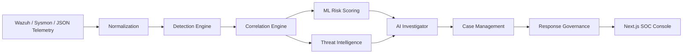
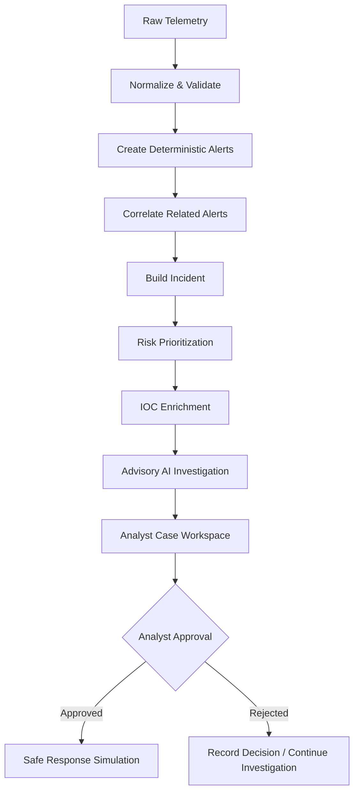

# IncidentForge

**AI-Assisted SOC Investigation & Incident Response Platform**

[](tests/)
[](dashboard/)
[](backend/)
[](#license)

---

### At a Glance

- **Purpose:** Defensive SOC orchestration, forensic investigation, and incident response platform.
- **Primary Focus:** Bridging multi-source endpoint telemetry, automated attack-sequence correlation, ML risk prioritization, structured advisory AI analysis, and analyst-governed response simulation.
- **Backend:** Python 3.10+, FastAPI, SQLModel / SQLAlchemy, SQLite (development store), Pydantic v2.
- **Frontend:** Next.js 16 (App Router), React, TypeScript, Tailwind CSS, Lucide Icons, Recharts.
- **Telemetry Sources:** Wazuh SIEM Manager (v4.9), Sysmon / Windows Event logs, and structured JSON feeds via `WazuhAlertAdapter`.
- **Machine Learning:** Transparent Logistic Regression baseline model with feature attribution scoring (0–100).
- **AI Engine:** Structured multi-phase investigation provider (`OBSERVED`, `INFERRED`, `RECOMMENDED`) with strict advisory boundaries.
- **Testing Coverage:** 223 automated unit and integration tests passing (`pytest`), clean Next.js static production build.

---

## Overview

IncidentForge is a defensive cybersecurity operations and investigation platform designed to manage the full lifecycle of a security event—from raw telemetry ingestion and rule-based detection to multi-alert correlation, machine learning risk prioritization, threat-intelligence enrichment, advisory AI-assisted investigation, SOC case management, analyst-controlled response simulation, and dataset security monitoring (v2).

Modern Security Operations Centers often struggle with disparate tools that emit fragmented alerts, leaving analysts to perform manual forensic correlation, ad-hoc risk assessment, and disjointed triage across separate consoles. IncidentForge addresses this operational friction by uniting the data plane and decision plane into an integrated, deterministic pipeline. Telemetry ingested into the system is normalized into canonical schemas, correlated into coherent attack sequences, enriched with indicator intelligence, and presented through an analyst-centric workspace.

Rather than positioning artificial intelligence as an unconstrained autonomous decision-maker, IncidentForge implements a human-in-the-loop security architecture. The AI Investigator operates strictly within an advisory boundary, structuring findings and identifying telemetry blind spots while delegating severity scoring and response approval entirely to deterministic models and authorized analysts. All containment and remediation capabilities are explicitly bounded within an allowlisted simulation sandbox, preventing unauthorized or destructive modifications to monitored infrastructure.

---

## Security Operations Problem

Security operations teams operate in an environment characterized by asymmetric operational challenges:

1. **Alert Fatigue:** High volumes of atomic, un-correlated alerts overwhelm analyst capacity and obscure multi-stage intrusion campaigns.
2. **Isolated Telemetry:** Security indicators are distributed across system logs, network monitors, and host sensors without unified cross-domain entities.
3. **Fragmented Investigation:** Analysts must manually pivot across threat intelligence databases, endpoint process trees, and MITRE ATT&CK references.
4. **Opaque Risk Prioritization:** Static alert severity tags fail to reflect dynamic contextual risk, entity diversity, or temporal proximity.
5. **Manual Threat Intelligence Enrichment:** Extracting and scoring observable IOCs (IPs, domains, hashes) manually slows down Mean Time to Respond (MTTR).
6. **Uncontrolled Automation Risks:** Full automated response without guardrails introduces severe operational and availability risks to production systems.
7. **Lack of Auditability:** Ad-hoc investigative steps and unrecorded containment attempts degrade forensic accountability and incident post-mortems.

IncidentForge systematically mitigates these challenges by establishing deterministic alert normalization, temporal attack-sequence correlation, mathematically transparent risk prioritization, automated IOC extraction, and an immutable audit trail governing every state transition, now spanning both endpoint and structured dataset activity.

---

## System Architecture

IncidentForge decouples high-volume telemetry processing (data plane) from investigative analysis, threat scoring, and response governance (decision and control planes):

```
┌────────────────────────────────────────────────────────────────────────────────────────┐
│                                       DATA PLANE                                       │
│                                                                                        │
│   Wazuh Manager / Sysmon / Synthetic Telemetry                                         │
│                          │                                                             │
│                          ▼                                                             │
│   ┌────────────────────────────────────────────────────────────────────────────────┐   │
│   │ Telemetry Adapter Boundary (`WazuhAlertAdapter` / `FixtureAdapter`)            │   │
│   └──────────────────────────────────────┬─────────────────────────────────────────┘   │
│                                          ▼                                             │
│   ┌────────────────────────────────────────────────────────────────────────────────┐   │
│   │ Normalization Service (`NormalizedEvent` Canonical Schema)                     │   │
│   └──────────────────────────────────────┬─────────────────────────────────────────┘   │
│                                          ▼                                             │
│   ┌────────────────────────────────────────────────────────────────────────────────┐   │
│   │ Event Pipeline (Persistence, Idempotency & Audit Logging)                      │   │
│   └──────────────────────────────────────┬─────────────────────────────────────────┘   │
└──────────────────────────────────────────┼─────────────────────────────────────────────┘
                                           │
┌──────────────────────────────────────────┼─────────────────────────────────────────────┐
│                                          ▼            ANALYSIS & DECISION PLANE        │
│   ┌────────────────────────────────────────────────────────────────────────────────┐   │
│   │ Detection Engine (Stateless Rule Evaluation → Deterministic `Alert` Creation)  │   │
│   └──────────────────────────────────────┬─────────────────────────────────────────┘   │
│                                          ▼                                             │
│   ┌────────────────────────────────────────────────────────────────────────────────┐   │
│   │ Correlation Engine (Time-Window Sequence Evaluation → Unified `Incident`)      │   │
│   └───────────────────┬──────────────────────────────────┬─────────────────────────┘   │
│                       │                                  │                             │
│                       ▼                                  ▼                             │
│   ┌──────────────────────────────────────┐   ┌─────────────────────────────────────┐   │
│   │ ML Risk Scorer (Feature Attribution) │   │ Threat Intel Service (IOC Lookup)   │   │
│   └───────────────────┬──────────────────┘   └───────────────────┬─────────────────┘   │
│                       │                                  │                             │
│                       └─────────────────┬────────────────┘                             │
│                                         ▼                                              │
│   ┌────────────────────────────────────────────────────────────────────────────────┐   │
│   │ AI Investigator (Advisory Analysis: Observed / Inferred / Gaps / Steps)        │   │
│   └──────────────────────────────────────┬─────────────────────────────────────────┘   │
│                                          ▼                                             │
│   ┌────────────────────────────────────────────────────────────────────────────────┐   │
│   │ Case Management (Analyst Collaboration, Notes, Evidence Pointers)              │   │
│   └──────────────────────────────────────┬─────────────────────────────────────────┘   │
└──────────────────────────────────────────┼─────────────────────────────────────────────┘
                                           │
┌──────────────────────────────────────────┼─────────────────────────────────────────────┐
│                                          ▼          RESPONSE GOVERNANCE & UI           │
│   ┌────────────────────────────────────────────────────────────────────────────────┐   │
│   │ Controlled Response Engine (Simulation Sandbox · Mandatory Analyst Approval)   │   │
│   └──────────────────────────────────────┬─────────────────────────────────────────┘   │
│                                          ▼                                             │
│   ┌────────────────────────────────────────────────────────────────────────────────┐   │
│   │ Next.js SOC Operations Console (Live Polling Telemetry & Incident Workspace)   │   │
│   └────────────────────────────────────────────────────────────────────────────────┘   │
└────────────────────────────────────────────────────────────────────────────────────────┘
```

The data plane guarantees that untrusted input is sanitized, validated, and normalized before crossing the pipeline boundary. The analysis plane evaluates detections, computes correlations, enriches observables, and formulates investigative summaries. Finally, the response governance layer isolates all containment actions behind human analyst approval gates and deterministic simulation sandboxes.

---

## Core Security Pipeline

IncidentForge processes security data through eleven distinct, deterministic stages:

1. **Telemetry Ingestion:** Receives raw security events via adapter interfaces (`TelemetryAdapter`), supporting file buffers, live log feeds, or HTTP endpoints.
2. **Normalization:** Converts heterogeneous data into the canonical `NormalizedEvent` model with standardized timestamp parsing, severity mapping (0–15), and credential scrubbing.
3. **Event Persistence & Auditing:** Persists incoming events and emits an immutable `AuditEvent` (`event.created` or `event.duplicate`), ensuring forensic traceability.
4. **Detection Engineering:** Evaluates newly persisted events against registered `DetectionRule` definitions, generating deterministic domain alerts (`alert-SHA256(event_id:rule_id)[:16]`).
5. **Attack-Sequence Correlation:** Matches incoming alerts against sliding temporal windows (e.g., 15-minute authentication sequences or 30-minute process/network sequences) sharing unified entity keys.
6. **Incident Aggregation:** Constructs and maintains the `Incident` lifecycle (`open`, `investigating`, `resolved`), linking correlated alerts, event IDs, and bounded evidence dictionaries.
7. **Risk Prioritization:** Evaluates incident features using a mathematical model to assign a 0–100 risk score, risk level badge, and feature contribution weights.
8. **Threat Intelligence Enrichment:** Extracts observable IOCs (IPv4 addresses, domain names, URLs, file hashes) from incident telemetry and performs automated provider lookups.
9. **AI-Assisted Investigation:** Analyzes evidence on demand, outputting structured empirical findings, inferred tactics, and recommended steps under an explicit advisory constraint.
10. **Case Management:** Coordinates SOC operations through dedicated cases, priority assignments, append-only analyst notes, and lightweight evidence references.
11. **Controlled Response:** Proposes sandbox containment actions requiring analyst approval before executing safe, non-destructive simulations.

---

## Detection Engineering

IncidentForge features a deterministic, stateless detection engine that evaluates normalized events against formal detection rules implementing the `DetectionRule` interface.

### Built-in Detection Rules & MITRE ATT&CK Mapping

| Rule ID | Rule Name | MITRE ATT&CK | Trigger Condition | Severity |
|---|---|---|---|---|
| `builtin-001` | High Severity Event | — | Event severity $\ge$ 10 | 10 (High) |
| `builtin-002` | Suspicious Process Execution | **T1059** (Command and Scripting Interpreter) | `process_start` referencing paths (`/tmp/`, `\temp\`) or encoded shells | 10 (High) |
| `builtin-003` | Authentication Failure | **T1110** (Brute Force) | `authentication_failure` or `login_failure` event types | 6 (Medium) |
| `builtin-004` | Network Connection Anomaly | **T1071** (Application Layer Protocol) | Outbound network connection to anomalous destination addresses | 4 (Low) |
| `builtin-005` | Privilege Escalation Indicator | **T1548** (Abuse Elevation Control Mechanism) | Event types matching `privilege_escalation`, `sudo`, or `runas` | 12 (Critical) |

### Engineering Guarantees
- **Deterministic Alert Identifiers:** Alert IDs are generated via cryptographic hashes of the event ID and rule ID (`alert-{hash}`), preventing alert duplication upon repeated ingestions.
- **Bounded Evidence Dictionaries:** Detection matches only store relevant operational fields (matched fields, thresholds, matched indicators), preventing unconstrained memory bloat.
- **Audit Logging:** Every alert creation or duplicate identification generates an immutable audit record (`alert.created` / `alert.duplicate`).

---

## Correlation & Incident Construction

In modern SOC operations, understanding the distinction between telemetry primitives is essential:

- **Event:** An individual record of system activity (e.g., a single failed logon attempt).
- **Alert:** A detection rule hit signaling that an individual event violated a security threshold.
- **Correlation:** An analytical grouping of related alerts linked by shared entities across a temporal window.
- **Incident:** An actionable security case requiring investigation, representing an active attack chain.

### Correlation Mechanics
The `CorrelationEngine` applies formal `CorrelationRule` contracts across historical sliding windows:

1. **Authentication Attack Sequence (`corr-rule-001`):** Correlates multiple `builtin-003` authentication failures targeting or originating from the same entity (`user:<id>`, `source_ip:<ip>`, or `host:<name>`) within a 900-second (15-minute) window. Severity escalates dynamically based on alert volume ($8 + (\text{count} - 2) \times 2$, bounded at 15).
2. **Process Network Sequence (`corr-rule-002`):** Correlates suspicious process execution (`builtin-002`) followed by an outbound network connection (`builtin-004`) on the same host within an 1800-second (30-minute) window.

When a correlation fires, the `IncidentService` automatically creates or updates an aggregate `Incident` record with unified tags, linked correlation IDs, and aggregated MITRE technique tags.

---

## ML Risk Prioritization

IncidentForge incorporates a transparent machine learning risk prioritization service (`RiskScoringService`) to assign an objective 0–100 risk score and categorical level (`LOW`, `MEDIUM`, `HIGH`, `CRITICAL`) to active incidents.

### Transparent Feature Attribution
Unlike black-box models, IncidentForge outputs mathematically interpretable feature contributions alongside every score:
- `incident_severity`: Base severity contribution of the incident.
- `correlation_severity`: Severity of upstream correlation matches.
- `entity_diversity`: Number of distinct users, hosts, and IP addresses involved.
- `has_auth_attack`: Binary indicator for authentication sequence patterns.
- `has_proc_net_attack`: Binary indicator for process/network sequence patterns.
- `alert_count`: Total alert volume enclosed in the incident.

```
Linear Logit Score ──► Logistic Sigmoid Function ──► Scaled Score (0–100)
```

> [!NOTE]
> **Evaluation Disclaimer:** The current model is a scikit-learn logistic regression baseline trained and evaluated on synthetic development datasets. It is designed to demonstrate transparent risk-ranking mechanics, automated feature extraction, and explainable feature contributions rather than real-world threat classification benchmarks.

---

## Threat Intelligence

The `ThreatIntelligenceService` provides automated indicator extraction and enrichment:

- **Observable Extraction:** Automated regex-based extraction of IPv4 addresses (excluding RFC 1918 private subnets and loopbacks), domain names, URLs, and cryptographic hashes (MD5, SHA-1, SHA-256).
- **Normalization & Deduplication:** Canonical lowercase normalization and deduplication across all alerts linked to an incident.
- **Provider Abstraction:** Implements a pluggable provider interface (`ThreatIntelProvider`). The default development environment utilizes a deterministic local provider (`LocalDevThreatIntelProvider`).
- **Enrichment Metadata:** Indicators are enriched with threat classifications (`malicious`, `suspicious`, `benign`, `unknown`), confidence ratings (0–100%), source counts, and contextual explanations.
- **Incident Linkage:** Enrichments are persisted in the database and linked to the active incident workspace.

---

## AI Investigator

The `AIInvestigatorService` provides automated, on-demand incident analysis and synthesis, serving as a cognitive multiplier for SOC analysts.

### Structured Analytic Output
Every AI investigation produces a structured `InvestigationResult`:
- **OBSERVED Findings:** Empirically verified indicators, affected entities, and confirmed alerts.
- **INFERRED Findings:** Probable attacker intentions, MITRE ATT&CK campaign associations, and inferred movement.
- **RECOMMENDED Steps:** Concrete forensic validation tasks and containment recommendations.
- **Investigation Gaps:** Explicit identification of telemetry blind spots (e.g., missing network PCAP, memory dumps, or process hierarchy logs).

### Defensive Governance & Advisory Boundaries
- **Strictly Advisory:** AI Investigator findings are explicitly advisory recommendations. AI output cannot approve response actions, alter incident severities, or modify endpoint configurations.
- **Untrusted Telemetry Handling:** Ingested event messages and metadata are treated as untrusted data; payloads are length-bounded and scrubbed for prompt injection vectors and credentials before reaching the provider.
- **Confidence Scoring:** Analyses include an explicit confidence score (e.g., 95%) derived from evidence density.

---

## Response Governance

IncidentForge enforces an industry-standard human-in-the-loop response governance architecture (Phase 10 specification).

### Safety Principles & Containment Sandbox
- **Simulation-Only Execution:** Response actions execute exclusively within a local, deterministic simulation sandbox. Under no circumstances will network interfaces be modified, accounts disabled, firewalls altered, or files deleted.
- **Mandatory Analyst Approval Gate:** Proposed actions strictly require human analyst authorization.
- **No Unsafe Sinks:** The codebase contains zero invocations of `subprocess`, `os.system`, shell interpreters, or PowerShell execution.

### Strict State Machine

```
              ┌─────────────┐
              │  PROPOSED   │
              └──────┬──────┘
                     │
           ┌─────────┴─────────┐
           ▼                   ▼
    ┌─────────────┐     ┌─────────────┐
    │  APPROVED   │     │  REJECTED   │ (terminal)
    └──────┬──────┘     └─────────────┘
           │
     ┌─────┴─────┐
     ▼           ▼
┌───────────┐ ┌────────┐
│ EXECUTED  │ │ FAILED │ (terminal)
└───────────┘ └────────┘
```

- Direct execution of a `PROPOSED` action is blocked with HTTP 409 Conflict.
- Terminal states (`EXECUTED`, `FAILED`, `REJECTED`) are strictly non-reusable and immutable.
- Actions are strictly restricted to an allowlist:
  1. `isolate_endpoint`: Simulates endpoint network isolation.
  2. `quarantine_file`: Simulates suspicious binary isolation.
  3. `revoke_credentials`: Simulates account credential invalidation.
- Every state change writes an immutable `AuditEvent` with sanitized actor attribution.

---

## Wazuh Integration

IncidentForge integrates with the open-source Wazuh SIEM stack via a dedicated ingestion adapter (`WazuhAlertAdapter` in [backend/app/adapters/wazuh.py](backend/app/adapters/wazuh.py)).

### Telemetry Mapping & Normalization
The adapter translates raw Wazuh JSON records (from `alerts.json` or manager APIs) directly into canonical `NormalizedEvent` structures:
- `id` $\rightarrow$ Deterministic event ID (`wazuh-alert-<id>`) ensuring idempotent ingestion.
- `rule.level` (0–16) $\rightarrow$ IncidentForge severity (0–15 scale).
- `rule.id`, `rule.description` $\rightarrow$ Alert rule metadata and human-readable message.
- `rule.mitre.id` $\rightarrow$ MITRE ATT&CK technique tags (e.g., `T1110`).
- `data.win.eventdata` / `agent` $\rightarrow$ Entity mappings for users, source/destination IPs, and hosts.
- `sanitize_value()` $\rightarrow$ Automatic regex-based redaction of passwords, tokens, API keys, and authorization headers.

### Known Infrastructure Compatibility Note
In Wazuh 4.9, the embedded Filebeat agent (v7.10.2) transmits legacy `_type: "_doc"` mapping metadata in bulk indexing requests. OpenSearch 2.13 (the engine powering Wazuh Indexer) strictly enforces Elasticsearch 8 / OpenSearch 2.x specifications and rejects requests specifying explicit document types.

Rather than compromising OpenSearch configuration or weakening cluster security, IncidentForge addresses this through its **Adapter Boundary Architecture**: the `WazuhAlertAdapter` consumes alerts directly from the manager log volume or API, bypassing the broken Filebeat-to-OpenSearch indexing path entirely.

---

## SOC Dashboard

The IncidentForge web console is built using Next.js 16 (App Router), React, TypeScript, and Tailwind CSS. It is designed as an operations interface with live polling telemetry updates.

### Module Navigation
- **Operations:**
  - `Overview` — High-level SOC posture, KPI metric chips, threat activity curves, MITRE technique distribution, and live alert streams.
  - `Alerts` — Tabular alert feed with severity filtering and rule attribution.
  - `Correlations` — Real-time view of active correlation sequence links.
- **Investigation:**
  - `Incidents` — Prioritized list of correlated incidents.
  - `Cases` — SOC case management queue and investigation assignments.
  - `AI Investigator` — Interactive advisory investigation console.
  - `Threat Intelligence` — Searchable IOC database and reputation table.
- **Response & System:**
  - `Response` — Controlled response queue and action approval interface.
  - `System` — System service health and API connectivity status.

### 8-Tab Incident Workspace
Selecting any incident opens the deep-inspection workspace:
1. **Overview:** Incident summary, correlation links, alert linkages, and ML/AI snapshot.
2. **Timeline:** Chronological event sequence derived from forensic investigation.
3. **Evidence:** Raw, bounded evidence JSON dictionary payloads.
4. **ML Risk:** 0–100 risk score breakdown, risk level, and feature contribution weights.
5. **AI Investigation:** Structured findings (`OBSERVED`, `INFERRED`, `RECOMMENDED`), telemetry gaps, and recommended next steps.
6. **Threat Intelligence:** Extracted IOC table with classifications, confidence scores, and providers.
7. **Case:** Dedicated SOC case tracking, priority, and analyst notes.
8. **Response:** Simulation-only containment action queue with analyst approval buttons.

---

## Security Model

IncidentForge is engineered from the ground up to follow defensive application security principles:

- **Secret & Key Hygiene:** Zero hardcoded credentials, API keys, or private keys in source code. Local environment files (`.env`, `.env.local`) are strictly excluded via `.gitignore`.
- **Credential Redaction:** Automated regex sanitization strips sensitive key-value pairs (passwords, auth tokens, bearer credentials, cookies) from all ingested logs, evidence payloads, and audit trails.
- **Untrusted Telemetry Boundary:** All inbound payloads pass through strict Pydantic v2 validation models (`extra="forbid"`) with bounded string lengths to prevent payload-based denial of service or injection.
- **Advisory AI Boundaries:** AI analysis cannot trigger containment actions or mutate operational severities.
- **Zero Destructive Sinks:** Absence of command-line execution sinks (`exec`, `eval`, `subprocess`, `os.system`, PowerShell).
- **Auditability:** Every event intake, alert generation, case status change, and response approval emits an immutable `AuditEvent` with UTC timestamps and actor attribution.

---

## Testing & Validation

IncidentForge maintains high software quality through automated regression testing and build validation:

```
============================== test session starts ==============================
rootdir: D:\IncidentForge, configfile: pyproject.toml, testpaths: tests
collected 223 items

tests/unit/test_adapters.py .                                            [  0%]
tests/unit/test_ai_investigator_service.py ............                  [  5%]
tests/unit/test_alert_service.py ........                                [  9%]
tests/unit/test_case_lifecycle.py ........                              [ 12%]
tests/unit/test_case_models.py ...........                              [ 17%]
tests/unit/test_case_persistence.py ...........                         [ 22%]
tests/unit/test_case_service.py ..............                          [ 28%]
tests/unit/test_correlation_engine.py ..........                        [ 33%]
tests/unit/test_correlation_persistence.py ............                 [ 38%]
tests/unit/test_correlation_rules.py .................                  [ 46%]
tests/unit/test_detection.py .........                                  [ 50%]
tests/unit/test_incident_persistence.py ............                    [ 55%]
tests/unit/test_incident_service.py ..............                      [ 61%]
tests/unit/test_investigation_persistence.py ..........                 [ 66%]
tests/unit/test_ioc_extractor.py ..........                             [ 70%]
tests/unit/test_llm_provider.py ...........                             [ 75%]
tests/unit/test_ml_features.py ...........                              [ 80%]
tests/unit/test_ml_model.py ...........                                 [ 85%]
tests/unit/test_ml_training.py ....                                     [ 87%]
tests/unit/test_models.py ......                                        [ 90%]
tests/unit/test_normalization.py ..                                     [ 91%]
tests/unit/test_persistence.py ..........                               [ 95%]
tests/unit/test_response_models.py ........                             [ 98%]
tests/unit/test_response_persistence.py ........                        [100%]
tests/unit/test_wazuh_adapter.py ......                                 [100%]
====================== 223 passed, 1 warning in 12.93s =======================
```

- **Backend Test Suite:** 223 unit and integration tests passing (`pytest -q`).
- **Frontend Production Build:** Compiles cleanly (`next build`) via Next.js Turbopack compiler.
- **Git Hygiene:** Clean working tree with zero whitespace or conflict marker defects (`git diff --check`).

---

## Reproducible Demo

A self-contained synthetic demonstration scenario is documented in [docs/demo_scenario.md](docs/demo_scenario.md).

The demo exercises the full end-to-end lifecycle using safe RFC 5737 documentation IP addresses (`198.51.100.23`) and synthetic analyst identities (`sec_analyst_test`):
1. Ingests two sequential brute-force authentication failures.
2. Demonstrates detection rule firing (`builtin-003`, MITRE `T1110`).
3. Demonstrates sliding-window correlation into an aggregate Incident (`corr-rule-001`).
4. Demonstrates automated ML risk scoring and IOC extraction.
5. Demonstrates AI Investigator execution with structured findings.
6. Exercises the response governance workflow: propose `isolate_endpoint` $\rightarrow$ analyst approval $\rightarrow$ simulation execution.

---

## Repository Structure

```
IncidentForge/
├── backend/                  # FastAPI backend application
│   └── app/
│       ├── adapters/         # Ingestion adapters (Wazuh, Fixtures, Base contract)
│       ├── api/routes/       # REST API endpoints (alerts, incidents, cases, etc.)
│       ├── ml/               # Risk scoring feature extraction & baseline training
│       ├── models/           # Pydantic v2 & SQLModel domain definitions
│       ├── persistence/      # Database models & repository layer
│       ├── rules/            # Detection & correlation rule implementations
│       └── services/         # Orchestration (pipeline, risk, TI, response, AI)
├── dashboard/                # Next.js 16 SOC web operations console
│   ├── app/                  # Next.js App Router pages and layout
│   ├── components/           # IncidentForge widgets, dashboard, and UI elements
│   └── lib/api/              # Strongly typed API client library
├── docs/                     # Technical specifications and architecture records
│   ├── architecture.md       # Comprehensive system architecture documentation
│   └── demo_scenario.md      # Synthetic SOC attack-sequence walkthrough
├── infrastructure/           # Docker Compose & local SIEM infrastructure configs
│   ├── configs/              # Sysmon and agent telemetry configuration templates
│   └── docker/               # Wazuh Manager, Indexer, and Dashboard container configs
├── tests/                    # Comprehensive automated testing suite
│   ├── integration/          # Multi-service API integration tests
│   └── unit/                 # Domain logic, adapter, engine, and repository tests
├── pyproject.toml            # Python packaging and dependency specifications
└── README.md                 # Primary platform documentation
```

---

## Local Development

### Prerequisites
- Python 3.10 or higher
- Node.js 18+ and `pnpm` (or `npm`)
- Git

### 1. Backend Setup

```bash
# Clone the repository
git clone https://github.com/hasinivinnakota/IncidentForge.git
cd IncidentForge

# Create and activate virtual environment
python -m venv .venv
# On Windows (PowerShell):
.venv\Scripts\Activate.ps1
# On Linux / macOS:
# source .venv/bin/activate

# Install backend dependencies via pyproject.toml
pip install -e ".[test]"

# Execute the complete automated test suite
pytest -q
```

### 2. Frontend Setup

```bash
cd dashboard

# Install frontend dependencies
pnpm install

# Verify production build compilation
pnpm run build
```

### 3. Running Locally

Start the backend API server:
```bash
# From repository root:
.venv\Scripts\python -m uvicorn backend.app.main:app --host 127.0.0.1 --port 8000
```

Start the Next.js development server:
```bash
# From dashboard/ directory:
cd dashboard
pnpm run dev --port 3000
```

Access the operations console in your browser at **`http://localhost:3000`**. The dashboard will display `API ONLINE` upon establishing connectivity with `http://127.0.0.1:8000`.

---

## Configuration

IncidentForge utilizes environment variables for operational configuration:

| Variable | Default Value | Description |
|---|---|---|
| `INCIDENTFORGE_API_PORT` | `8000` | Port for the FastAPI backend server |
| `INCIDENTFORGE_LOG_LEVEL` | `INFO` | Application logging verbosity (`DEBUG`, `INFO`, `WARNING`) |
| `INCIDENTFORGE_DATABASE_URL` | `sqlite:///backend/data/incidentforge.db` | Database connection string |
| `INCIDENTFORGE_CORS_ORIGINS` | `http://localhost:3000,http://127.0.0.1:3000` | Comma-delimited allowlisted CORS origins |
| `NEXT_PUBLIC_API_BASE_URL` | `http://127.0.0.1:8000` | Frontend backend API base endpoint URL |

---

## Limitations

- **Synthetic Baseline ML:** The machine learning risk model is trained and evaluated on synthetic development datasets. It demonstrates explainable prioritization mechanics rather than real-world predictive accuracy.
- **Simulation Sandbox:** All response actions are strictly simulated to preserve absolute host safety; live network or operating system state is never altered.
- **SIEM Bulk Ingestion Limitation:** Live continuous indexing into Wazuh Indexer is restricted by the upstream Filebeat 7.10.2 / OpenSearch 2.13 `_type` incompatibility. IncidentForge operates via direct adapter consumption to ensure non-blocking ingestion.
- **Controlled Local Lab Scope:** Infrastructure is scoped for local engineering development and forensic research rather than multi-tenant enterprise deployment.
- **Advisory AI:** AI investigation outputs are designed as decision support tools and do not execute automated system containment.

---

## Roadmap

Future engineering directions planned for the platform include:
- **Expanded Detection Engineering:** Community Sigma rule parser integration and additional MITRE ATT&CK coverage rules.
- **Advanced Telemetry Connectors:** Live syslog listeners, Zeek network telemetry adapters, and cloud audit trail ingestion.
- **Enterprise Persistence:** Migration path from SQLite to PostgreSQL with Alembic database schema migrations.
- **Model Evolution:** Supervised and anomaly-based risk models evaluated against public security benchmarks (e.g., CIC-IDS).
- **External Ticketing Integrations:** Bidirectional webhooks for Jira, TheHive, and ServiceNow case synchronization.
- **Extended Response Playbooks:** Pluggable response adapters supporting real containment execution in dedicated, disposable hypervisor sandboxes.

---

## License

This project is released under the terms of the MIT License for educational, research, and defensive portfolio demonstration purposes.


## Visual Architecture



## Incident Investigation Flow


